# Image-Editor1
## Overview
##### This Java program is designed to perform various image processing operations on input images. It provides a command-line interface for users to select and apply different image manipulation techniques.

## Functions of Image Editor

- Print Pixels: Display the pixel values (RGB) of the input image.
- Convert to Gray: Convert the input image to grayscale.
- change Brightness: Adjust the brightness of the image by a specified percentage.
- Rotate Image: Choose between rotating the image to the right or left.
- Vertically Invert: Vertically flip the image.
- Horizontally Invert: Horizontally flip the image.
- Blur Image: Blur the image with a specified pixel size.
- Apply Color Filter: Apply color filters (Red, Blue, or Green) to the image.
- Crop Image: Crop the image from different directions (Top, Bottom, Left, Right, Top and Bottom, Left and Right, or All Directions).
- Invert Colors: Invert the colors of the image.

## Introduction
##### This program is a Java-based image processing utility that allows users to perform various operations on input images. It provides a user-friendly interface for selecting and applying image manipulation techniques such as brightness adjustment, rotation, color filtering, cropping, and more.
## Getting Started

Follow these steps to get started with the Java Image Editor:

### Prerequisites

- Java Installed on the device
- Any Java IDE.
- An Image.
### Libraries Needed:-
  - java.awt.Color;
  - java.awt.image.BufferedImage;
  - java.io.File;
  - java.io.IOException;
  - java.util.*;
  - javax.imageio.ImageIO;

## Input Image:
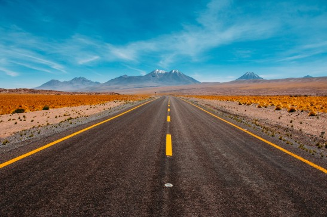

## Explainations of all functions

### 1.Print pixels :
##### this function iterates over all the pixels of the image and prints their RGB values.

### 2.Convert to GrayScale:
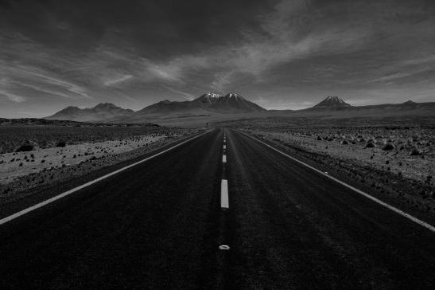
##### The method first retrieves the height and width of the input image to determine its dimensions.
- It creates a new BufferedImage, grayImage, with the same dimensions as the input image, but of type BufferedImage.TYPE_BYTE_GRAY, which represents a grayscale image.
- It iterates over each pixel in the input image using nested loops. For each pixel, it retrieves the RGB value (color) and sets the corresponding pixel in the grayImage to the same value. This process effectively converts each color pixel to its grayscale equivalent.
- After processing all pixels, the method returns the grayImage, which now contains the input image converted to grayscale.

### 3.Change Brightness
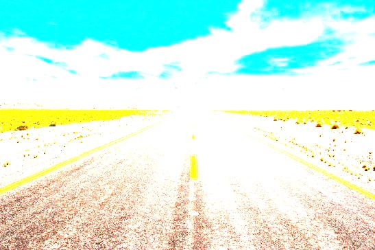
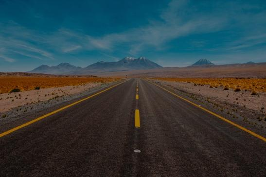
##### This function is used to increase the brightness of an input image by a specified percentage a. It iterates through each pixel of the input image, adjusts the RGB values based on the brightness percentage, and ensures that the resulting values are within the valid RGB range (0-255).
- **Parameters**

input (BufferedImage): The input image on which brightness adjustment will be applied.
a (int): The percentage by which to increase the brightness. A positive value will increase brightness, while a negative value will decrease it. Valid range is -100 to 100.
 
- **Returns**

output (BufferedImage): The processed image with increased brightness.

### 4.Rotate Image Clockwise
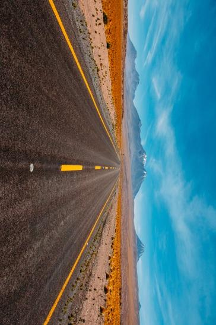
##### - The method first retrieves the height and width of the input image to determine its dimensions.
- It creates a new BufferedImage, outputImage, with swapped width and height compared to the input image, effectively creating a new image with rotated dimensions.
- It iterates over each pixel in the input image using nested loops. For each pixel, it retrieves the RGB value (color) from the input image and sets it in the outputImage with the row and column positions swapped. This swapping of rows and columns results in the image being rotated 90 degrees clockwise.
- After processing all pixels, the method proceeds with an additional step to complete the clockwise rotation:
   1) It calculates the new dimensions of the outputImage (swapped width and height).
   2) It iterates through half of the newWidth (the width of the rotated image divided by 2 and the full newHeight.
   3) For each pixel, it performs a swap operation between the left and right halves of the image columns, effectively rotating the image 90 degrees clockwise.
- After processing all pixels, the method returns the outputImage, which now contains the input image rotated 90 degrees clockwise.

### 5.Rotate Image Anti-Clockwise
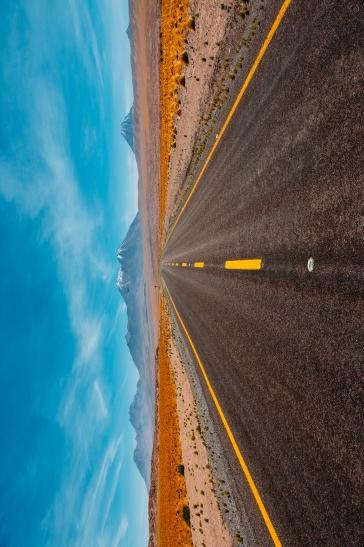
##### - The method first retrieves the height and width of the input image to determine its dimensions.
- It creates a new BufferedImage, outputImage, with swapped width and height compared to the input image, effectively creating a new image with rotated dimensions.
- It iterates over each pixel in the input image using nested loops. For each pixel, it retrieves the RGB value (color) from the input image and sets it in the outputImage with the row and column positions swapped. This swapping of rows and columns results in the image being rotated 90 degrees anticlockwise.
- After processing all pixels, the method returns the outputImage, which now contains the input image rotated 90 degrees anticlockwise.   

### 6.Horizantally Invert
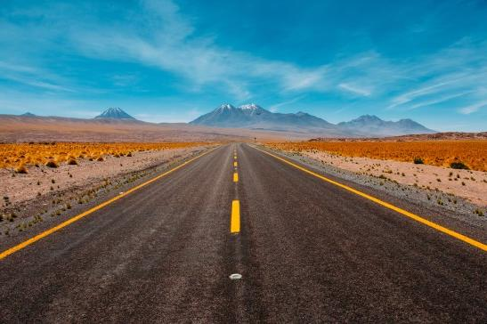
##### This Java code defines a method invertImageHorizontally to horizontally flip a BufferedImage. It iterates through half of the image's width, swapping pixel values from left to right within each row to create a horizontally inverted version of the input image. The result is stored in outputImage, which is returned at the end.

### 7. Vertically Invert
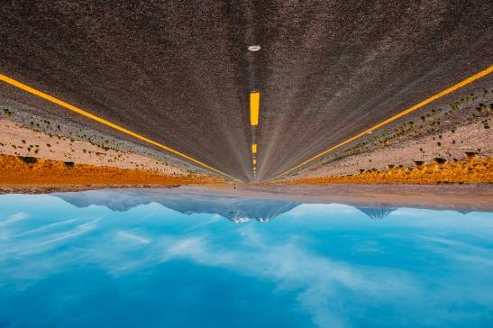
#####  This Java method, invertImageVertically, flips the input image vertically along its horizontal axis. It iterates through half of the image's height and swaps pixel values between the top and bottom halves to achieve vertical inversion. The result is returned as outputImage.

### 8.Blurring Image 
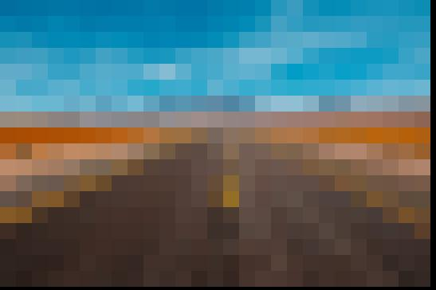
- The method retrieves the height and width of the input image to determine its dimensions.
- It creates a new BufferedImage, outputImage, with the same dimensions as the input image.
- It iterates through the input image in smaller grids of size sizeMatrix * sizeMatrix using nested loops:
- For each grid, it calculates the average red, green, and blue values by summing the color values of all pixels within the grid and dividing by the total number of pixels in the grid (sizeMatrix * sizeMatrix).
It then assigns the average color values to all pixels within the grid in the outputImage, effectively blurring the image within that grid.
After processing all grids, the method returns the outputImage, which now contains the input image with a blurring effect applied.

### 9. Applying Colour filter 
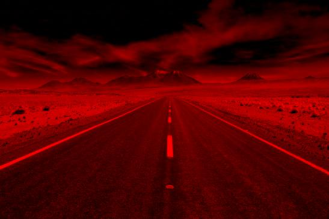
##### This function applies a red filter to an input image by removing the green and blue components, effectively isolating the red channel. It iterates through each pixel of the input image, sets the green and blue values to zero while preserving the red value, creating a red-filtered output.

#### Same follows for green and blue filter.

### 10. Crop Image 

##### This function crops an input image by removing a specified number of pixels from all four sides (top, bottom, left, and right) of the image. It essentially trims the image by pixels pixels from each side, resulting in a smaller image with its center portion preserved.

- Parameters
input (BufferedImage): The input image that you want to crop.
pixels (int): The number of pixels to be removed from each side of the input image. For example, if you specify pixels as 10, it will remove 10 pixels from the top, bottom, left, and right sides.
- Returns
output (BufferedImage): The cropped image with the specified number of pixels removed from all sides.

### 11. Color Inversion
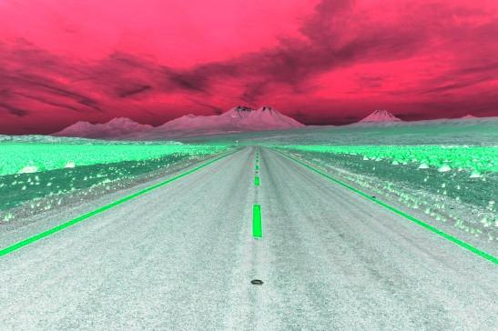
##### This function inverts the colors of an input image by subtracting the RGB values of each pixel from 255, effectively creating a negative image. It iterates through each pixel of the input image, calculates the inverted RGB values, and generates an output image with the inverted colors.

- Parameters
input (BufferedImage): The input image for which you want to invert the colors.
- Returns
output (BufferedImage): The processed image with inverted colors.

# HOW TO USE ? 
Run the program and provide the path to the input image file.

Choose one of the following operations by entering the corresponding number:

1) Convert to Grayscale
2) Rotate Image Anticlockwise
3) Rotate Image Clockwise
4) Change Brightness
5) Invert Image Vertically
6) Invert Image Horizontally
7) Apply Pixelated Blur
8) Apply colour Filter
9) Apply Colour Inversion
10) Crop Image

- Depending on your choice, you may need to provide additional information such as the brightness change percentage or blur size matrix.

- Enter the name for the output image file (e.g., "output.jpg").

- The program will perform the selected operation on the input image and save the resulting image as the specified output file.
